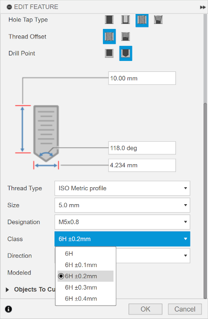

This repository contains a set of Fusion 360 thread definitions for ISO metric
threads with adjustible tolerances, for use with 3D printing. They are inspired
by, but in no way derived from, [this project][replicant-3dp-threads].

# Usage

Once installed, each ISO Metric Profile thread size above 2mm will have 9
additional thread classes, from ±.1mm to ±.9mm, which create threads with the
given tolerances:



The ±.1mm threads, for example, will be .1mm larger for internal threads and
.1mm smaller for external threads. The thickness of the thread helix will be
exactly the same in all cases; only the inner and outer diameter will change.
Below, on the left, is an M5 hole with ±.3mm clearance and a screw with standard
clearance, compared with an M5 hole and screw both with standard clearance on
the right:

<div style="display: flex; justify-content: space-between;">


</div>

# Installation

The `adjust_threads.py` script generates a new set of thread definitons based on
the stock Fusion 360 `ISOMetricprofile.xml` thread definitions file:

```
python adjust_threads.py ISOMetricprofile.xml >ISOMetricTolerances.xml
```

To use the definitions, they must be installed into Fusion 360's thread
definition directory for your user account. You may simply overwrite the
existing `ISOMetricprofile.xml` file, or create a new file with any arbitrary
name you choose.

For Windows, the thread definitions are stored in:

```
%LocalAppData%\Autodesk\webdeploy\Production\<version ID>\Fusion\Server\Fusion\Configuration\ThreadData
```

and for MacOS, they are stored in:

```
~/Library/Application Support/Autodesk/Webdeploy/production/<version ID>/Autodesk Fusion 360.app/Contents/Libraries/Applications/Fusion/Fusion/Server/Fusion/Configuration/ThreadData
```

where `<version ID>` is a hash value specific to each Fusion 360 version. You
will typically want the folder with the most recent modification date, and you
will need to re-install in the appropriate folder for the current version after
each update unless you use the [ThreadKeeper][threadkeeper] add-on.

[replicant-3dp-threads]: https://replicantfx.com/custom-threads-with-fusion-360/

[threadkeeper]: https://apps.autodesk.com/FUSION/en/Detail/Index?id=1725038115223093226
